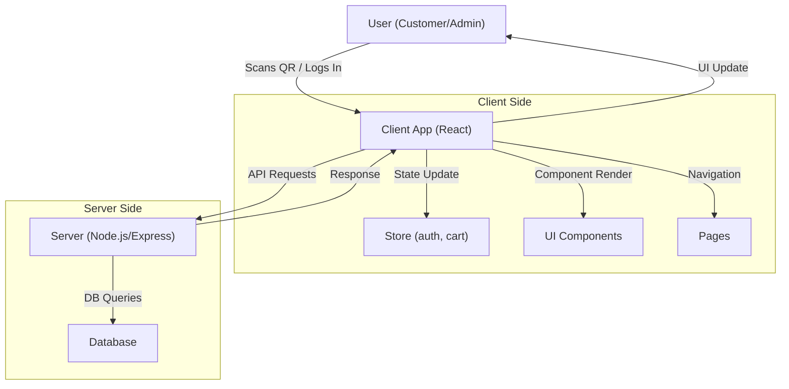
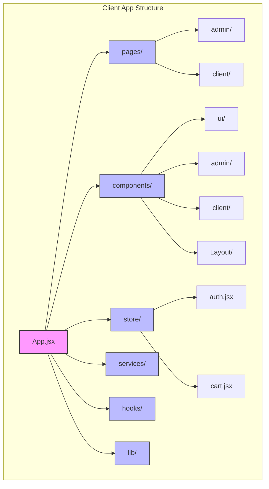
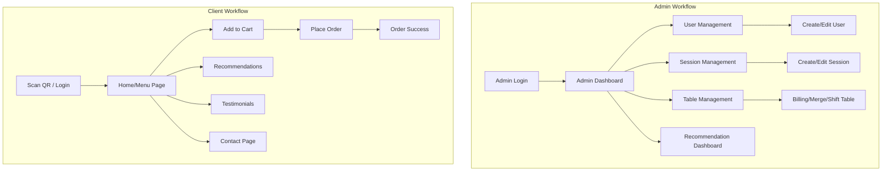

# Restaurant QR Order System – Client

This is the **client-side** (frontend) application for the Restaurant QR Order System, built with **React** and **Vite**. It provides a modern, responsive interface for both restaurant customers and administrators, supporting features like QR-based ordering, menu browsing, session and table management, and more.

---

## Table of Contents
- [Project Structure](#project-structure)
- [Architecture Overview](#architecture-overview)
- [Client App Structure](#client-app-structure)
- [Workflows](#workflows)
- [Key Directories & Files](#key-directories--files)
- [Getting Started](#getting-started)
- [Development](#development)
- [Contributing](#contributing)

---

## Project Structure

```
client/
  ├── public/                # Static assets (images, icons, etc.)
  ├── src/                   # Main source code
  │   ├── assets/            # App-specific static assets
  │   ├── components/        # Reusable UI and feature components
  │   ├── hooks/             # Custom React hooks
  │   ├── lib/               # Utility functions
  │   ├── pages/             # Route-level pages (admin/client)
  │   ├── services/          # API and service logic
  │   ├── store/             # State management (auth, cart, etc.)
  │   ├── App.jsx            # Main app component
  │   ├── main.jsx           # Entry point
  │   ├── App.css, index.css # Global styles
  ├── package.json           # Project dependencies and scripts
  ├── vite.config.js         # Vite configuration
  └── README.md              # This file
```

---

## Architecture Overview

This diagram shows the high-level flow of data and user interaction in the system:



---

## Client App Structure

The following chart visualizes the main structure of the client app:



---

## Workflows

### Admin and Client User Journeys



---

## Key Directories & Files

### src/

#### components/
- **ui/**: A comprehensive set of reusable UI components (buttons, dialogs, forms, tables, etc.) for consistent design and rapid development.
- **admin/**: Components specific to admin features, organized by domain:
  - **user-management/**: Sidebars for creating/editing users.
  - **session-management/**: Sidebars for session details, creation, and editing.
  - **table-management/**: Modals for billing, table details, merging, and shifting tables.
  - `RecommendationDashboard.jsx`, `Clear-Filter.jsx`: Admin dashboards and utilities.
- **Layout/**: Layout components for navigation bars, footers, and user/admin layouts.
- **client/**: Components for the customer-facing experience (menu, recommendations, testimonials, etc.).
- `Loader.jsx`: A loading spinner or indicator.

#### pages/
- **admin/**: All admin-facing pages (login, home, management dashboards, etc.), including layouts for admin and table views.
- **client/**: All customer-facing pages (home, menu, cart, login/register, QR, order success, etc.).
- **dev/**: (If present) Developer or test pages.
- `Error.jsx`: Error boundary or error page.

#### store/
- `auth.jsx`: Handles authentication state and logic.
- `cart.jsx`: Manages the shopping cart state.

#### services/
- (Currently empty or to be filled) – Intended for API calls, business logic, or service abstractions.

#### hooks/
- `use-mobile.js`, `use-query-media.js`: Custom React hooks for responsive design and media queries.

#### assets/
- `favicon.ico`, `FDLogo.png`, `react.svg`: App icons and logos.

#### lib/
- `utils.js`: Utility/helper functions used across the app.

---

### App.jsx & main.jsx
- **App.jsx**: The root React component, sets up routing, context providers, and global layout.
- **main.jsx**: The entry point that renders the App component into the DOM.

---

## Getting Started

1. **Install dependencies:**
   ```bash
   cd client
   npm install
   ```
2. **Run the development server:**
   ```bash
   npm run dev
   ```
   The app will be available at `http://localhost:5173` (or as specified in the terminal).
3. **Build for production:**
   ```bash
   npm run build
   ```
4. **Preview the production build:**
   ```bash
   npm run preview
   ```

---

## Development
- **Component-driven:** Most UI and logic are broken into reusable components.
- **State management:** Uses custom store modules for authentication and cart.
- **Routing:** Managed via React Router (see `App.jsx`).
- **Styling:** Global styles in `App.css` and `index.css`, with component-level styles as needed.
- **Extensible:** Easily add new pages, components, or services by following the existing structure.

---

## Contributing
1. Fork the repository and create a new branch for your feature or bugfix.
2. Follow the existing code style and structure.
3. Add documentation/comments where helpful.
4. Submit a pull request with a clear description of your changes.

---

## Notes
- For backend/server details, see the `server/` directory and its own README.
- For recommendations and system design, see `RECOMMENDATION_SYSTEM.md` in the root.
