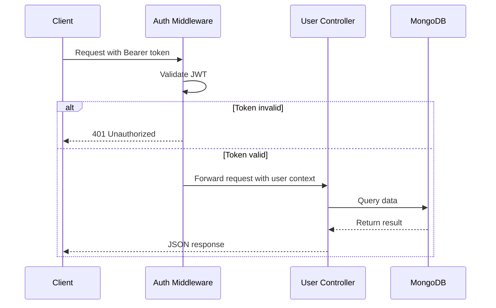
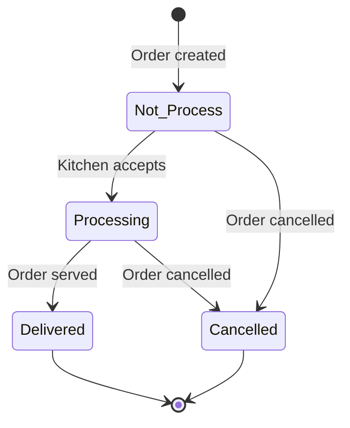
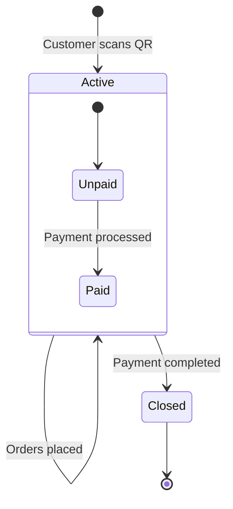

# User Controller API

## Base URL

```
/api/user
```

## Authentication

All endpoints require a valid JWT token in the Authorization header:

```
Authorization: Bearer <jwt_token>
```


## Request Flow




## Endpoints

### GET `/sessions`

Returns all sessions for the authenticated user, sorted by creation date descending.

**Response**

```json
{
  "success": true,
  "data": [
    {
      "_id": "session_id",
      "tableNo": 5,
      "isActive": true,
      "isPaid": false,
      "paymentStatus": "Unpaid",
      "paymentMethod": "",
      "finalAmount": 1250,
      "startedAt": "2024-01-15T10:30:00.000Z",
      "endedAt": null,
      "createdAt": "2024-01-15T10:30:00.000Z",
      "updatedAt": "2024-01-15T10:30:00.000Z",
      "totalOrders": 3,
      "totalAmount": 1250,
      "orders": []
    }
  ]
}
```


### GET `/session/:sessionId/orders`

Returns detailed order information for a specific session.

**Path Parameters**

| Parameter | Type | Required | Description |
|-----------|------|----------|-------------|
| `sessionId` | string | Yes | Valid MongoDB ObjectId |

**Response**

```json
{
  "success": true,
  "data": {
    "session": {
      "_id": "session_id",
      "tableNo": 5,
      "isActive": true,
      "isPaid": false,
      "paymentStatus": "Unpaid",
      "paymentMethod": "",
      "finalAmount": 1250,
      "startedAt": "2024-01-15T10:30:00.000Z",
      "endedAt": null
    },
    "orders": [
      {
        "id": "order_id",
        "sessionId": "session_id",
        "tableNo": 5,
        "items": [
          {
            "id": "item_id",
            "name": "Butter Chicken",
            "description": "Creamy and rich chicken curry",
            "price": 450,
            "quantity": 2,
            "category": "Main Course",
            "image": "butter-chicken.jpg",
            "vegetarian": false,
            "spicy": false,
            "status": "Processing",
            "totalPrice": 900
          }
        ],
        "amount": 900,
        "status": "Processing",
        "paymentStatus": "Pending",
        "paymentMethod": "Cash",
        "createdAt": "2024-01-15T10:35:00.000Z",
        "updatedAt": "2024-01-15T10:35:00.000Z",
        "totalItems": 1,
        "estimatedTime": "5-10 minutes"
      }
    ],
    "summary": {
      "totalAmount": 1250,
      "totalOrders": 3,
      "pendingOrders": 2,
      "deliveredOrders": 1
    }
  }
}
```


### GET `/active-session`

Returns the currently active session for the user with full order details.

**Response**

```json
{
  "success": true,
  "data": {
    "session": {
      "_id": "session_id",
      "tableNo": 5,
      "isActive": true,
      "isPaid": false,
      "paymentStatus": "Unpaid",
      "finalAmount": 1250
    },
    "orders": [],
    "totalAmount": 1250,
    "totalOrders": 3
  }
}
```


### GET `/profile`

Returns the authenticated user's profile.

**Response**

```json
{
  "success": true,
  "data": {
    "_id": "user_id",
    "name": "John Doe",
    "email": "john@example.com",
    "phone": "1234567890",
    "isGoogleAccount": false,
    "createdAt": "2024-01-01T00:00:00.000Z",
    "updatedAt": "2024-01-01T00:00:00.000Z"
  }
}
```


### PUT `/profile`

Updates the authenticated user's profile.

**Request Body**

| Field | Type | Required | Constraints |
|-------|------|----------|-------------|
| `name` | string | No | Min 3, max 255 characters |
| `phone` | string | No | Min 10, max 20 characters |

```json
{
  "name": "John Doe",
  "phone": "1234567890"
}
```

**Response**

```json
{
  "success": true,
  "message": "Profile updated successfully",
  "data": {
    "_id": "user_id",
    "name": "John Doe",
    "email": "john@example.com",
    "phone": "1234567890",
    "isGoogleAccount": false,
    "createdAt": "2024-01-01T00:00:00.000Z",
    "updatedAt": "2024-01-15T12:00:00.000Z"
  }
}
```


### GET `/orders`

Returns paginated order history for the authenticated user.

**Query Parameters**

| Parameter | Type | Required | Default | Description |
|-----------|------|----------|---------|-------------|
| `page` | number | No | `1` | Page number |
| `limit` | number | No | `10` | Items per page (1–100) |
| `status` | string | No | — | Filter by status: `Not Process`, `Processing`, `Delivered`, `Cancelled` |

**Response**

```json
{
  "success": true,
  "data": {
    "orders": [
      {
        "id": "order_id",
        "tableNo": 5,
        "items": [],
        "amount": 900,
        "status": "Delivered",
        "paymentStatus": "Paid",
        "paymentMethod": "Cash",
        "createdAt": "2024-01-15T10:35:00.000Z",
        "session": {
          "_id": "session_id",
          "tableNo": 5,
          "isActive": false,
          "startedAt": "2024-01-15T10:30:00.000Z"
        },
        "totalItems": 1
      }
    ],
    "pagination": {
      "currentPage": 1,
      "totalPages": 5,
      "totalOrders": 50,
      "hasNextPage": true,
      "hasPrevPage": false
    }
  }
}
```


## Order Lifecycle



## Session Lifecycle




## Error Responses

All endpoints return errors in a consistent format:

```json
{
  "success": false,
  "message": "Error description",
  "extraDetails": "Additional context"
}
```

| Status Code | Meaning |
|-------------|---------|
| `200` | Success |
| `404` | Resource not found |
| `422` | Validation error |
| `500` | Internal server error |


## Data Models

### Session

| Field | Type | Default | Notes |
|-------|------|---------|-------|
| `_id` | ObjectId | — | Auto-generated |
| `tableNo` | Number | — | Required |
| `isActive` | Boolean | `true` | |
| `isPaid` | Boolean | `false` | |
| `users` | ObjectId[] | — | References User |
| `orders` | ObjectId[] | — | References Order |
| `startedAt` | Date | now | |
| `endedAt` | Date | — | Optional |
| `paymentMethod` | String | `""` | `Cash`, `Online`, `Razorpay`, `""` |
| `paymentStatus` | String | — | `Unpaid`, `Paid` |
| `finalAmount` | Number | `0` | |

### Order

| Field | Type | Notes |
|-------|------|-------|
| `_id` | ObjectId | Auto-generated |
| `sessionId` | ObjectId | Required, references Session |
| `buyer` | ObjectId | Required, references User |
| `tableNo` | Number | Required |
| `products` | Array | Order line items |
| `amount` | Number | Required |
| `status` | String | `Not Process`, `Processing`, `Delivered`, `Cancelled` |
| `paymentStatus` | String | `Pending`, `Paid`, `Unpaid` |
| `paymentMethod` | String | `Cash`, `Online`, `Counter`, `Pending`, `Razorpay` |

### Service (Menu Item)

| Field | Type | Default | Notes |
|-------|------|---------|-------|
| `_id` | ObjectId | — | Auto-generated |
| `name` | String | — | Required |
| `description` | String | — | Required |
| `price` | Number | — | Required |
| `category` | String | — | `Appetizer`, `Main Course`, `Dessert`, `Beverage` |
| `image` | String | — | Optional |
| `vegetarian` | Boolean | `false` | |
| `spicy` | Boolean | `false` | |
| `available` | Boolean | `true` | |