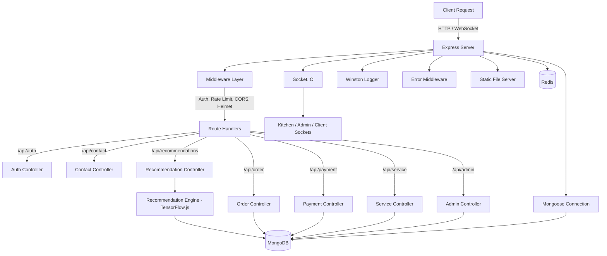
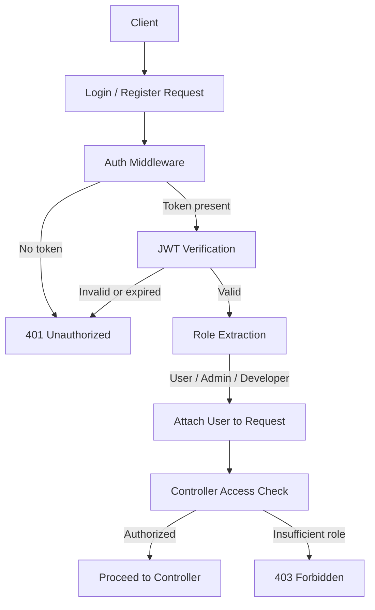
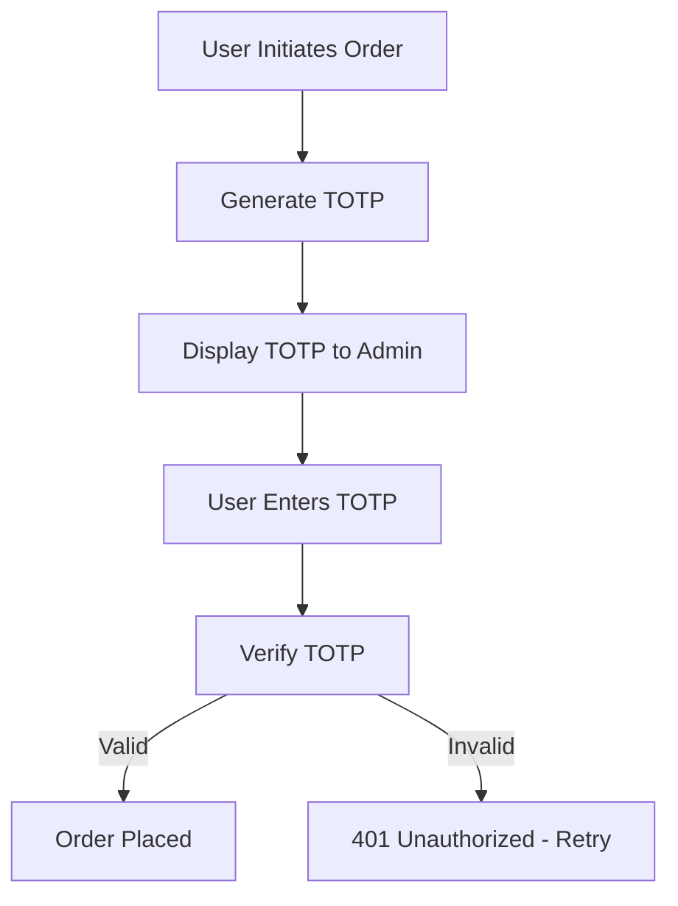
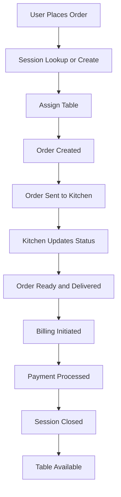

# Restaurant QR Order System — Backend

## Technology Stack

| Layer | Technology |
|-------|-----------|
| Runtime | Node.js with Express.js 5.x |
| Database | MongoDB via Mongoose ODM |
| Cache / Pub-Sub | Redis |
| Real-time | Socket.IO |
| Machine Learning | TensorFlow.js |
| Logging | Winston |
| Job Queue | Bull |
| Payments | Razorpay |
| Validation | Zod |
| Security | Helmet, CORS, Redis-backed rate limiting |

## High-Level Architecture

Express.js orchestrates all HTTP and WebSocket traffic through a modular controller layer. MongoDB handles persistent storage, Redis handles rate limiting and caching, and Socket.IO delivers real-time updates to kitchen, admin, and client interfaces. A hybrid TensorFlow.js recommendation engine runs alongside the main request lifecycle.

## Request / Response Flow

## Controller Responsibilities

```mermaid
flowchart TD
    subgraph Controllers
        A1[Auth]
        A2[Order]
        A3[Payment]
        A4[Service]
        A5[Contact]
        A6[Recommendation]
        A7[Admin]
        A8[Kitchen]
        A9[Developer]
    end

    A1 --> B1[JWT Generation]
    A1 --> B2[2FA / TOTP Verification]
    A2 --> B3[Order Model]
    A2 --> B4[Session and Table Model]
    A3 --> B5[Razorpay API]
    A3 --> B6[Payment Model]
    A4 --> B7[Service Model - Menu CRUD]
    A5 --> B8[Contact Model]
    A6 --> B9[Recommendation Engine]
    A6 --> B10[UserPreference Model]
    A7 --> B11[Admin / Session / Table Models]
    A7 --> B12[Analytics and Stats]
    A8 --> B13[Socket.IO Events]
    A9 --> B14[Developer Model]
```

## Authentication Flow

## TOTP Order Placement Flow

TOTP is used exclusively for order placement. When a user initiates an order, a time-based one-time password is generated and displayed to both the user and the admin. The order is only confirmed after the user submits the correct TOTP.

## Order Session Lifecycle

## Database Models

| Model | Purpose |
|-------|---------|
| User, Admin, Developer | Authentication, roles, and preferences |
| Order | Order lifecycle and line items |
| Session | Groups orders for a table visit |
| Table | Physical table state |
| Service | Menu items, categories, and attributes |
| Recommendation | Item embeddings, co-occurrence data, model metadata |
| Payment | Payment status and Razorpay transaction records |
| Contact | Customer support submissions |
| PasswordToken | Password reset tokens |

## Recommendation Engine

The engine combines a TensorFlow.js neural network with co-occurrence statistics for a hybrid approach to menu recommendations.

- Trained on up to 6 months of order history
- Generates item embeddings updated on each training run
- Incorporates user preferences including dietary restrictions, price range, and past favorites
- Produces real-time suggestions as cart contents change
- Falls back to co-occurrence statistics when the neural model is unavailable
- Model metadata tracks version, training date, and status

## Security

- JWT authentication with role-based access for user, admin, and developer roles
- Redis-backed rate limiting applied globally and on sensitive endpoints
- Helmet for HTTP header hardening
- Strict CORS origin policy
- Centralized error middleware formats all errors consistently before returning to client
- Winston logs all errors, warnings, and info persistently to file and console

## Developer Reference

| Topic | Location |
|-------|----------|
| Entry point | `server.js` |
| Controllers | `controllers/` |
| Route definitions | `routes/` |
| Database models | `database/models/` |
| Recommendation engine | `utils/recommendation-engine.js` |
| Logger configuration | `utils/logger.js` |
| Environment config | `.env` |

Start the server with `npm run dev` (development) or `npm start` (production). New features should follow the existing pattern of adding a controller in `controllers/` and registering routes in `routes/`.