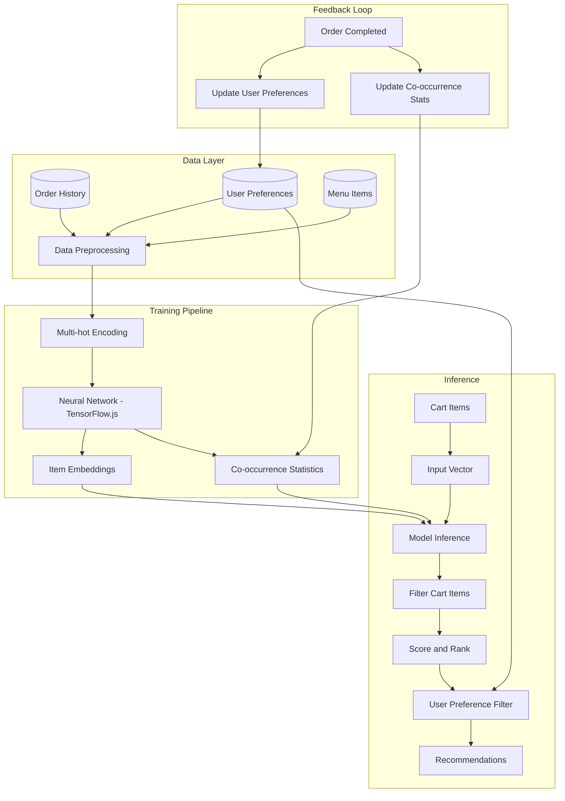
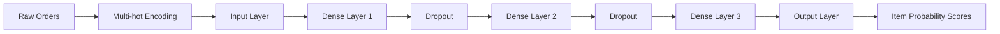

# Food Recommendation System

A real-time, personalized food recommendation engine built with TensorFlow.js and collaborative filtering for the QR-based restaurant ordering system.


## Overview

The recommendation system combines a neural network trained on historical order data with statistical co-occurrence analysis to produce fast, relevant menu suggestions. It runs alongside the main request lifecycle and updates continuously as users place orders.


## Architecture




## How It Works

### 1. Data Collection

- Analyzes completed orders from the past 6 months
- Tracks individual user preferences and ordering patterns
- Uses menu item attributes including category, price, and dietary information

### 2. Model Training

- Orders are converted to binary multi-hot vectors
- A 4-layer dense neural network with dropout learns item relationships
- Binary cross-entropy loss for multi-label prediction
- 50 training epochs with a validation split



### 3. Recommendation Generation

- Cart items are converted to a multi-hot input vector
- The neural network predicts probability scores for all menu items
- Items already in the cart are filtered out
- Results are ranked by prediction confidence
- User preference filters are applied as a final pass
- Falls back to co-occurrence statistics if the neural model is unavailable

### 4. Real-time Updates

- User preferences are updated automatically on order completion
- Co-occurrence and popularity statistics refresh in the background
- Model retraining runs as a non-blocking background process


## Backend Components

### Database Models (`server/database/models/recommendation-model.js`)

| Model | Purpose |
|-------|---------|
| `ItemEmbedding` | Learned vector representations of menu items |
| `CoOccurrence` | Statistical relationships between item pairs |
| `ModelMetadata` | Model configuration and training history |
| `UserPreference` | Per-user behavior and preference data |

### Recommendation Engine (`server/utils/recommendation-engine.js`)

- 4-layer dense neural network for collaborative filtering
- Automatic data preparation and training pipeline
- Real-time inference with sub-100ms response times
- Item embedding generation and persistence

### API Controller (`server/controllers/recommendation-controller.js`)

Handles all recommendation endpoints, model management, and admin analytics.


## API Reference

### Public Endpoints

#### Get Cart-based Recommendations

```http
POST /api/recommendations/cart
Content-Type: application/json

{
  "cartItems": ["itemId1", "itemId2"],
  "limit": 5
}
```

#### Get Popular Items

```http
GET /api/recommendations/popular?limit=10&category=Main Course
```

#### Get User Recommendations

```http
GET /api/recommendations/user?limit=5
Authorization: Bearer <token>
```

#### Get Similar Items

```http
GET /api/recommendations/similar/:itemId?limit=5
```

### Admin Endpoints

| Method | Endpoint | Description |
|--------|----------|-------------|
| POST | `/api/recommendations/retrain` | Trigger model retraining |
| GET | `/api/recommendations/status` | Get model training status |
| GET | `/api/recommendations/analytics` | Get usage analytics |

All admin endpoints require `Authorization: Bearer <admin_token>`.


## Frontend Integration

### Client Component

```jsx
import Recommendations from './components/client/Recommendations';

<Recommendations
  cartItems={cartItems}
  onAddToCart={handleAddToCart}
  userId={currentUser?.id}
/>
```

The component exposes two tabs: Smart Picks (cart-based and personalized) and Popular Items. It refreshes automatically when cart contents change.

### Fetching Recommendations

```jsx
const fetchRecommendations = async () => {
  const response = await axios.post('/api/recommendations/cart', {
    cartItems: cartItems.map(item => item.id)
  });
  setRecommendations(response.data.data);
};

useEffect(() => {
  if (cartItems.length > 0) fetchRecommendations();
}, [cartItems]);
```

### Personalized Recommendations (authenticated users)

```jsx
const fetchUserRecommendations = async () => {
  const response = await axios.get('/api/recommendations/user', {
    headers: { Authorization: `Bearer ${token}` }
  });
  setUserRecommendations(response.data.data);
};

useEffect(() => {
  if (user && cartItems.length === 0) fetchUserRecommendations();
}, [user, cartItems]);
```

### Admin Dashboard

```jsx
import RecommendationDashboard from './components/admin/RecommendationDashboard';

<RecommendationDashboard />
```

The admin dashboard provides model status monitoring, training controls, top item combinations, category distribution, and user engagement metrics.


## Configuration

### Model Parameters

```javascript
// server/utils/recommendation-engine.js
const modelConfig = {
  embeddingDimension: 32,
  epochs: 50,
  batchSize: 32,
  learningRate: 0.001,
  dropoutRate: 0.3
};
```

### Initialization

On server startup the engine will automatically train a new model if none exists, update co-occurrence statistics, and generate item embeddings. No manual initialization is required.


## Performance

| Metric | Value |
|--------|-------|
| Training time | ~2–5 minutes for 1,000+ orders |
| Inference latency | Under 100ms |
| Memory footprint | ~50MB for model and embeddings |
| Minimum training data | 100+ orders recommended |

Recommendations improve in accuracy as more order data accumulates. The engine uses batch tensor operations and database indexing to keep inference fast at scale.


## Troubleshooting

**Model not training** — Verify MongoDB is connected, confirm order data exists in the database, and check server logs for TensorFlow.js initialization errors.

**Poor recommendation quality** — Ensure at least 100 completed orders exist for training. Check that item availability flags are current. Use the admin retrain endpoint to force a fresh training run.

**Slow response times** — Monitor memory usage during inference. Check for missing database indexes on the recommendation collections. Verify Redis is available for caching frequently requested results.

### Debug Commands

```bash
# Check model status
curl -X GET http://localhost:5000/api/recommendations/status

# Force model retraining
curl -X POST http://localhost:5000/api/recommendations/retrain

# Test cart-based recommendations
curl -X POST http://localhost:5000/api/recommendations/cart \
  -H "Content-Type: application/json" \
  -d '{"cartItems": ["itemId1"], "limit": 5}'
```


## Contributing

1. Fork the repository
2. Create a feature branch
3. Implement changes with tests
4. Submit a pull request

